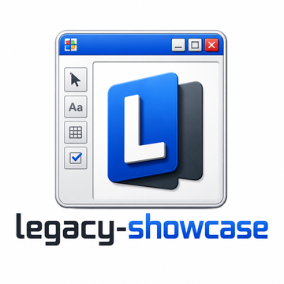

<div align="center">
  
  <h1 align="center">legacy-showcase</h1>
  <p align="center">
    ERP desktop em Windows Forms com SQLite embarcado, importação de TXT e CSV<br>
    e exportação para planilha, com a mesma base de código rodando no navegador.
  </p>
  <a href="https://dotnet.microsoft.com"></a>
  <a href="https://learn.microsoft.com/dotnet/csharp/"></a>
  <a href="https://learn.microsoft.com/dotnet/desktop/winforms/"></a>
  <a href="https://learn.microsoft.com/aspnet/core/blazor/"></a>
  <a href="https://learn.microsoft.com/ef/core/"></a>
  <br>
  
  <a href="../../releases/latest/download/LegacyShowcase-windows-x64.exe"></a>
  <a href="https://ls.thiagocaja.dev"></a>
</div>

<br>

Este é o espelho público de distribuição do **legacy-showcase**, e guarda só o
executável do Windows. O código-fonte está no repositório de desenvolvimento, e a
página que você está lendo serve a quem quer baixar e abrir o programa.

> **Versão publicada: v0.12.0**
>
> Este repositório guarda **uma versão só**. Cada publicação apaga a release e a
> tag anteriores, então o que está em [Releases](../../releases/latest) é sempre o
> estado corrente do `main`. O nome do arquivo não carrega o número da versão, que
> aparece só na tag, e por isso `releases/latest/download/` funciona como endereço
> permanente. O histórico de mudanças está no CHANGELOG do repositório de
> desenvolvimento.

## Conceitos fundamentais

| Termo | O que é |
| :-- | :-- |
| **self-contained** | Publicação que leva o runtime do .NET dentro dela, sem exigir instalação prévia |
| **arquivo único** (single file) | Todo o conteúdo publicado empacotado em um `.exe` só, extraído para pasta temporária ao abrir |
| **SmartScreen** | Filtro do Windows que avisa ao abrir um executável sem assinatura de certificado de código |
| **migração** (migration) | Alteração de estrutura do banco versionada em código, aplicada na abertura do programa |
| **WebAssembly** | Formato que roda código compilado dentro do navegador, e o que permite o mesmo C# atender a versão web |

## Baixar

| Plataforma | Arquivo | Requisito |
| :-- | :-- | :-- |
| Windows | [`LegacyShowcase-windows-x64.exe`](../../releases/latest/download/LegacyShowcase-windows-x64.exe) | Windows 10 ou 11, 64 bits |
| Linux e macOS | (sem download) | atendido pela [versão web](https://ls.thiagocaja.dev) |

**Por que não há Linux nem macOS.** Windows Forms é uma camada sobre a API de
janelas do Windows e não existe fora dela. Essa superfície Win32 é o que o projeto
se propõe a demonstrar, então trocar por um framework multiplataforma mudaria o
assunto do showcase. Quem usa Linux ou macOS abre a versão web, que roda o mesmo
núcleo de domínio compilado para WebAssembly.

## O que esperar ao abrir

**O download é o programa, não um instalador.** Abrir o arquivo é executar: nada
é instalado, nada é escrito no registro do Windows, e apagar o arquivo desfaz
tudo.

**O SmartScreen avisa na primeira execução**, porque o executável não é assinado
por certificado de código. Clique em **Mais informações** e depois em **Executar
assim mesmo**.

**Nada precisa ser instalado antes.** A publicação é self-contained e de arquivo
único, com o runtime do .NET embutido. A primeira execução demora mais que as
seguintes, porque o conteúdo é extraído para uma pasta temporária antes de rodar.

**O banco de dados é criado na primeira execução**, em
`%LOCALAPPDATA%\legacy-showcase\legacy.db`. As migrações são aplicadas na
abertura e uma carga de demonstração entra com clientes e lançamentos. O arquivo
não fica junto do executável porque o programa pode ser aberto de uma pasta
somente leitura ou de rede, e um banco embarcado precisa de lugar gravável. A
credencial de acesso já vem preenchida na tela de login.

## Atualizar de uma versão anterior

Baixe o arquivo novo e substitua o antigo. Não há desinstalação, porque não houve
instalação.

O banco fica na pasta de dados do usuário e não junto do executável, então os
dados continuam disponíveis depois da troca, e as migrações pendentes são
aplicadas na primeira abertura da versão nova. Feche o programa antes de
substituir o arquivo, ou o Windows recusa a escrita. Para começar de um banco
vazio, apague a pasta `%LOCALAPPDATA%\legacy-showcase`.

## O aplicativo

Um showcase de ERP legado: login, usuários, clientes e lançamentos financeiros,
sobre um SQLite embarcado. O centro dele é o que o trabalho de manutenção costuma
pedir, que é importar arquivo TXT de posição fixa e CSV, com recusa relatada linha
a linha, e exportar para planilha.

- **Domínio:** `User`, `Customer` (nome, documento, contato, endereço) e
  `FinancialEntry` (tipo, valor, cliente, vencimento, baixa)
- **Interface:** Windows Forms com janela MDI, tema claro e escuro, escala de
  texto ajustável e busca por `Ctrl+K`
- **Dados:** SQLite local via EF Core, migrações na abertura e carga de
  demonstração
- **Arquivos:** importação de TXT de posição fixa e de CSV, com Windows-1252 e
  Latin-1 lidos corretamente, e exportação para XLSX
- **Acesso:** credencial de demonstração, já preenchida na tela de login

Os dados ficam na máquina e não saem dela. Não há servidor, não há sincronização,
e nenhum dado é enviado para fora.

## Padrão do projeto

O repositório de desenvolvimento é um núcleo compartilhado com duas frentes de
entrega:

```
src/Domain            entidades e objetos de valor, sem dependência de framework
src/Application       casos de uso e as interfaces de repositório
src/Infrastructure    EF Core e SQLite, para a frente desktop
src/FileInterop       leitores de TXT e CSV, escritores de planilha
src/Desktop.WinForms  frente desktop (Windows Forms), este download
src/Web.Blazor        frente web (Blazor WebAssembly), site estático
tests/                xUnit v3 com Shouldly, sobre o núcleo
```

A regra que sustenta o arranjo: as duas frentes não contêm nada além de
apresentação. Repositório é interface declarada em `Application`, com uma
implementação em EF Core para o desktop e outra em memória para o navegador, e
trocar uma pela outra não altera nenhum caso de uso.

## Stack

.NET 10 · C# 14 · Windows Forms · Blazor WebAssembly · EF Core 10 · SQLite ·
ClosedXML · Argon2id

## Licença

Os binários seguem a licença do repositório de desenvolvimento.
